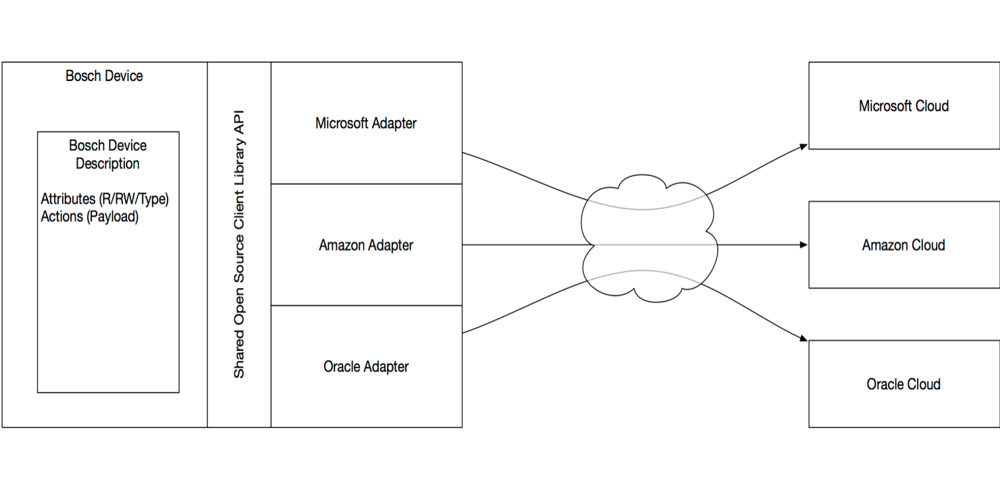

# Unified Device Model Proposal

## What is a Device Model?

A device model is a formal description of a class of physical devices. 
The description contains entries for metadata fields (tags), attributes (properties) and actions.

Metadata fields contain static values such as "device manufacturer", "hardware version", "creation date".

Attributes (properties) contain values that typically change over time, such as sensor readings, actuator settings, status values or configuration information.

Actions are called to trigger an activity on the device.

This abstract model of a device can be applied to all devices in the market. It intentionally does not talk about messages and protocols or specific program languages.

## Purpose of a Device Model

A device model can be used to create applications that interact with a device. In today's world, specific applications have to be written per device class. These applications typically operate with an implicit model of a device, i.e. they contain code to manipulate device properties or to call actions. The programmer has to read a device manual to implement his application.

With a device model a more generic application (or library) can be created, which can interact with all devices that implement this common description. This reduces the effort for the integration of devices in IoT scenarios.

## Why a *Unified* Device Model?

There are several device models in the market, which are used in conjunction with specific protocols or define a generic mechanism for protocol binding.
Some of them are standardised in different SDOs such as the W3C, OCF, IPSO and others. 

Large IoT cloud vendors also use different models in their products. Some of them only define metadata and attributes (properties) but leave it to the applications to handle actions and messages.

This fragmentation limits interoperability and market adoption of IoT devices.

The benefit of a unified device model is to simplify device integration and interoperability between (typically small embedded) devices and IoT service platforms from multiple vendors. 

A high level of interoperability brings faster time-to-market, since it minimizes the integration effort between device manufactureres and cloud vendors.
It protects the customer investment and makes device and applications future-proof, since it enables easy integration across multiple clouds.

It enables migration scenarios where devices can continue to be used when one of the cloud platform providers discontinues his service.

## Background 

The Unified Device Model specification is influenced by products from major cloud vendors and IoT standards, including but not limited to:

##### W3C Web of Things 
[https://w3c.github.io/wot-thing-description/]()

##### Microsoft's Device Twin
[https://github.com/MicrosoftDocs/azure-docs/blob/master/articles/iot-hub/iot-hub-devguide-device-twins.md]()

##### Amazon's Device Shadow
[https://docs.aws.amazon.com/iot/latest/developerguide/what-is-aws-iot.html]()

##### Mozilla's Web Thing API
[https://iot.mozilla.org/wot/]()

## Terminology

The following section contains terminology definitions that are used by this specification. Not that some
products in the market use the same concepts under a different terminology, e.g. "attributes" for "properties", or "properties" for "class or devcie metadata".

* Device (Device-Instance)
	
	A physical or logical entity that is managed by an IoT Cloud Service
	
* Device Class
	
	A group of devices that implement the same Device Model
	
* Digital Twin

	A (virtual) representation of a device in an IoT Cloud Service

* Device Description  
	A textual description of a device instance

* Device Model 	
	A textual description of a device class
	
* Property  
	A part of the device that contains state information and may change over time

* Action  
	A part of a device that can be invoked from the outside to change the state of a device
	
* Metadata  
	A part of the device that contains values that describe the device class or device instance

* Class Metadata  
	Metadata elements that are common for all devices of the class.
	
* Device Metadata (Instance Metadata) 
	Metadata elements that apply for instances of the class. Examples are the geographic location, software version, name, id.

* Messages  
  	Data that is being sent between the device and the cloud
  

## Microsoft's device twin

Device twins can contain arbitrary JSON objects as both tags and properties. 

	{
	    "deviceId": "myDeviceId",
	    "etag": "AAAAAAAAAAc=",
	    "status": "enabled",
	    "statusUpdateTime": "0001-01-01T00:00:00",    
	    "connectionState": "Disconnected",    
	    "lastActivityTime": "0001-01-01T00:00:00",
	    "cloudToDeviceMessageCount": 0,
	    "authenticationType": "sas",    
	    "x509Thumbprint": {    
	        "primaryThumbprint": null,
	        "secondaryThumbprint": null
	    },
	    "version": 2,
	    "tags": {
	        "location": {
	            "region": "US",
	            "plant": "Redmond43"
	        }
	    },
	    "properties": {
	        "desired": {
	            "telemetryConfig": {
	                "configId": "db00ebf5-eeeb-42be-86a1-458cccb69e57",
	                "sendFrequencyInSecs": 300
	            },
	            "$metadata": {
	            ...
	            },
	            "$version": 4
	        },
	        "reported": {
	            "connectivity": {
	                "type": "cellular"
	            },
	            "telemetryConfig": {
	                "configId": "db00ebf5-eeeb-42be-86a1-458cccb69e57",
	                "sendFrequencyInSecs": 300,
	                "status": "Success"
	            },
	            "$metadata": {
	            ...
	            },
	            "$version": 7
	        }
	    }
	}
	
	
## Microsoft's Device API

The Device twin API defines the following methods:

| Function | Description |
| -------- | ----------- |
| Get Device Twin | Get a device twin. |
| Invoke Device Method | Invoke a direct method on a device. |
| Update Device Twin | 	Updates tags and desired properties of a device twin. |

https://docs.microsoft.com/en-us/rest/api/iothub/devicetwinapi

	
## Microsoft's Device Model Schema

Microsoft uses a Device Model Schema to define simulated devices for remote monitoring. The schema defines a set of properties, telemetry-messages, a simulation model and cloud-to-device methods.

https://docs.microsoft.com/en-us/azure/iot-suite/iot-suite-remote-monitoring-device-schema

	{
	  "SchemaVersion": "1.0.0",
	  "Id": "elevator-01",
	  "Version": "0.0.1",
	  "Name": "Elevator",
	  "Description": "Elevator with floor, vibration and temperature sensors.",
	  "Protocol": "AMQP",
	  "Simulation": {
	    // Specify the simulation behavior
	  },
	  "Properties": {
	    // Define properties
	  },
	  "Telemetry": [
	    // Specify telemetry
	  ],
	  "CloudToDeviceMethods": {
	    // Specify methods
	  }
	}

### Microsoft Device Model Schema example (chiller-02)

The following schema example from https://github.com/Azure/device-simulation-dotnet/blob/master/Services/data/devicemodels/chiller-02.json defines a device model of a chiller. 

It defines a concrete device instance (properties and tags) with a simulation model and interactions via methods.
The model defines a specific protocol (MQTT) and a Telemetry message template and schema for message payloads.  It describes interactions via a set of CloudToDevice methods, which are implemented by Javascript callbacks.

The simulation is initialized with an initial state and an update script (chiller-02-state.js) which is
called at regular intervals. 

The example below defines the schema as well as a simulation and a set of properties and tags for a specific device instance. 

	{
	    "SchemaVersion": "1.0.0",
	    "Id": "chiller-02",
	    "Version": "0.0.1",
	    "Name": "Faulty Chiller",
	    "Description": "Faulty chiller with wrong pressure sensor. Pressure too high.",
	    "Protocol": "MQTT",
	    "Simulation": {
	        "InitialState": {
	            "online": true,
	            "temperature": 75.0,
	            "temperature_unit": "F",
	            "humidity": 70.0,
	            "humidity_unit": "%",
	            "pressure": 250.0,
	            "pressure_unit": "psig",
	            "simulation_state": "high_pressure"
	        },
	        "Interval": "00:00:10",
	        "Scripts": [
	            {
	                "Type": "javascript",
	                "Path": "chiller-02-state.js"
	            }
	        ]
	    },
	    "Properties": {
	        "Type": "Chiller",
	        "Firmware": "1.0",
	        "Model": "CH101",
	        "Location": "Building 43",
	        "Latitude": 47.639318,
	        "Longitude": -122.134271
	    },
	    "Tags": {
	        "Location": "Building 43",
	        "Floor": "3",
	        "Campus": "Redmond"
	    },
	    "Telemetry": [
	        {
	            "Interval": "00:00:10",
	            "MessageTemplate": "{\"temperature\":${temperature},\"temperature_unit\":\"${temperature_unit}\",\"humidity\":${humidity},\"humidity_unit\":\"${humidity_unit}\",\"pressure\":${pressure},\"pressure_unit\":\"${pressure_unit}\"}",
	            "MessageSchema": {
	                "Name": "chiller-sensors;v1",
	                "Format": "JSON",
	                "Fields": {
	                    "temperature": "double",
	                    "temperature_unit": "text",
	                    "humidity": "double",
	                    "humidity_unit": "text",
	                    "pressure": "double",
	                    "pressure_unit": "text"
	                }
	            }
	        }
	    ],
	    "CloudToDeviceMethods": {
	        "Reboot": {
	            "Type": "javascript",
	            "Path": "Reboot-method.js"
	        },
	        "FirmwareUpdate": {
	            "Type": "javascript",
	            "Path": "FirmwareUpdate-method.js"
	        },
	        "EmergencyValveRelease": {
	            "Type": "javascript",
	            "Path": "EmergencyValveRelease-method.js"
	        },
	        "IncreasePressure": {
	            "Type": "javascript",
	            "Path": "IncreasePressure-method.js"
	        }
	    }
	}

## Oracle's Device Model

Oracle's device model serves as a blueprint/template to define new device instances (digital twins).
Device models are managed by the IoT Cloud Service platform and are used to create and register device instances. The IoT Cloud Service platform defines a REST-API to query, export and import device models.

A device model defines a set of metadata fields, properties, actions, message formats and links.
It is protocol agnostic, however it defines globally unique message formats
A device model has a globally unique id (urn). 

A concrete device and it's digital twin may implement more than one device models. 

### Oracle device model example (chiller-02) 

	{
	    "urn": "urn:com:oracle:iot:chiller-02",
	    "name": "chiller-02",
	    "description": "Faulty chiller with wrong pressure sensor. Pressure too high.",
	    "system": false,
	    "draft": false,
	    "created": 1524652689668,
	    "createdAsString": "2018-04-25T10:38:09.668Z",
	    "lastModified": 1524653984604,
	    "lastModifiedAsString": "2018-04-25T10:59:44.604Z",
	    "userLastModified": "IoTAdmin",
	    "attributes": [
	        {
	            "description": "",
	            "name": "Type",
	            "type": "STRING",
	            "writable": true
	        },
	        {
	            "description": "",
	            "name": "Firmware",
	            "type": "STRING",
	            "writable": true
	        },
	        {
	            "description": "",
	            "name": "Model",
	            "type": "STRING",
	            "writable": true
	        },
	        {
	            "description": "",
	            "name": "Location",
	            "type": "STRING",
	            "writable": true
	        },
	        {
	            "description": "",
	            "name": "Latitide",
	            "type": "NUMBER",
	            "writable": true
	        },
	        {
	            "description": "",
	            "name": "Longitude",
	            "type": "NUMBER",
	            "writable": true
	        },
	        {
	            "description": "",
	            "name": "Location_tag",
	            "type": "STRING",
	            "writable": true
	        },
	        {
	            "description": "floor level",
	            "name": "Floor_tag",
	            "type": "STRING",
	            "writable": true
	        },
	        {
	            "description": "name of the campus",
	            "name": "Campus_tag",
	            "type": "STRING",
	            "writable": true
	        },
	        {
	            "description": "online status",
	            "name": "online",
	            "type": "BOOLEAN",
	            "writable": true
	        },
	        {
	            "description": "",
	            "name": "temperature",
	            "type": "NUMBER",
	            "writable": true
	        },
	        {
	            "description": "C for Celsius, F for Fahrenheit",
	            "name": "termperature_unit",
	            "type": "STRING",
	            "writable": true
	        },
	        {
	            "description": "humidity of the chiller",
	            "name": "humidity",
	            "type": "NUMBER",
	            "writable": true
	        },
	        {
	            "description": "percentage or grams per m3",
	            "name": "humidity_unit",
	            "type": "STRING",
	            "writable": true
	        },
	        {
	            "description": "",
	            "name": "pressure",
	            "type": "NUMBER",
	            "writable": true
	        },
	        {
	            "description": "psi or pascal or bar",
	            "name": "pressure_unit",
	            "type": "STRING",
	            "writable": true
	        },
	        {
	            "alias": "ora_lat",
	            "name": "ora_latitude",
	            "range": "-90.0,90.0",
	            "type": "NUMBER",
	            "writable": false
	        },
	        {
	            "alias": "ora_lon",
	            "name": "ora_longitude",
	            "range": "-180.0,180.0",
	            "type": "NUMBER",
	            "writable": false
	        },
	        {
	            "alias": "ora_alt",
	            "name": "ora_altitude",
	            "type": "NUMBER",
	            "writable": false
	        },
	        {
	            "alias": "ora_accuracy",
	            "name": "ora_uncertainty",
	            "type": "NUMBER",
	            "writable": false
	        },
	        {
	            "name": "ora_zone",
	            "type": "STRING",
	            "writable": false
	        },
	        {
	            "alias": "ora_mssi",
	            "name": "ora_txPower",
	            "type": "INTEGER",
	            "writable": false
	        },
	        {
	            "name": "ora_rssi",
	            "type": "NUMBER",
	            "writable": false
	        }
	    ],
	    "actions": [
	        {
	            "alias": "Reboot-method",
	            "description": "Reboot the chiller",
	            "name": "Reboot"
	        },
	        {
	            "alias": "FirmwareUpdate-method",
	            "argType": "STRING",
	            "description": "Update the firmware to the version specified in the argument",
	            "name": "FirmwareUpdate"
	        },
	        {
	            "alias": "EmergencyValveRelease-method",
	            "description": "Open valve for emergency reasons",
	            "name": "EmergencyValveRelease"
	        },
	        {
	            "alias": "IncreasePressure-method",
	            "argType": "INTEGER",
	            "description": "Increase the pressure with the value in the argument",
	            "name": "IncreasePressure",
	            "range": "0,5"
	        }
	    ],
	    "formats": [
	        {
	            "urn": "urn:com:oracle:iot:chiller-02-sensors",
	            "name": "chillersensors",
	            "description": "",
	            "type": "DATA",
	            "deviceModel": "urn:com:oracle:iot:chiller-02",
	            "value": {
	                "fields": [
	                    {
	                        "name": "temperature",
	                        "optional": false,
	                        "type": "NUMBER"
	                    },
	                    {
	                        "name": "temperature_unit",
	                        "optional": false,
	                        "type": "STRING"
	                    },
	                    {
	                        "name": "humidity",
	                        "optional": false,
	                        "type": "NUMBER"
	                    },
	                    {
	                        "name": "humidity_unit",
	                        "optional": false,
	                        "type": "STRING"
	                    },
	                    {
	                        "name": "pressure",
	                        "optional": false,
	                        "type": "NUMBER"
	                    },
	                    {
	                        "name": "pressure_unit",
	                        "optional": false,
	                        "type": "STRING"
	                    }
	                ]
	            },
	            "sourceId": "urn:com:oracle:iot:chiller-02",
	            "sourceType": "DEVICE_MODEL"
	        }
	    ],
	    "links": [
	        {
	            "href": "https://129.144.182.85:443/iot/api/v2/deviceModels/urn%3Acom%3Aoracle%3Aiot%3Achiller-02",
	            "rel": "self"
	        },
	        {
	            "href": "https://129.144.182.85:443/iot/api/v2/deviceModels/urn%3Acom%3Aoracle%3Aiot%3Achiller-02",
	            "rel": "canonical"
	        }
	    ]
	}
	
# Comparison of the two device models

Both models define a set of properties and interactions with the device via actions.

### Properties
The **Oracle device model** defines data types for properties (simple JSON types and a few extensions: URL, time+date).
A type range may be specified for numeric types; write access can be restricted.
Properties may contain a description and an alias.

The properties in the **Microsoft device model** example are plain JSON values. The example does not contain types and type ranges, description or alias fields.

### Actions

Both models define actions that can be performed on a device (and a device twin). The **Microsoft device model** does not define descriptions, alias or parameter types. All actions in the example do not contain parameters. The example binds each action to an implementation via a Javascript file.

The **Oracle device model** defines actions with **only a single** parameter of a **primitive JSON** type. An action can have a
description and an alias.

### Message protocols and formats

Both models provide a way to define the payload structure of messages between the device and the cloud service via message formats. Even though the payload formats are defined in the model, the actual transport protocols are usually proprietary and not exposed through the model.

# Unified Device Model

The following section defines a common device model for describing device classes.
The device model intentionally is protocol agnostic. 
Also device onboarding, lifecycle operations and security mechanisms are out of scope.

Devices following this model can be defined by device manufacturers or cloud vendors and can be shared across different cloud platforms. Enterprise applications can use
these descriptions in the same way to use digital twin instances hosted as virtual device representations in the cloud.

The model is intentionally kept as simple as possible to accomodate for very resource constrained devices. Therefore it does not include complex types, actions with optional parameters, defaults or multiple return parameters. This may appear simplistic, however it serves the purpose to minimize the implementation effort on a device.

## Capabilities of the model

The device model serves as an intermediate between devices and cloud services. Since it describes the device in an abstract way, it does not contain protocol bindings.
Rather it defines the commonalities of a device, which are available for all connected cloud services:

All devices contain metadata, attributes (properties) and actions. 

### Metadata

The model defines a set of mandatory metadata fields that must be provided by all implementing devices. It also defines a set of optional metadata fields. This is necessary to ensure the minimum interoperability guarantees of the model. The set of metadata fields can be extended with vendor specific additional fields.

### Properties

Properties can be read and some of them can be written by the cloud application. Properties have a primitive type and optionally have a unit and a range. They may carry a semantic type. If complex types are required, these should be marshalled in a string.

### Actions

A cloud application can invoke actions on the device. 

An action has a name, a set of input parameters and a result value. An action is synchronous and can return a simple type as return value. If an asynchronous action is required, it can be implemented in this model in different ways. 

#### 1. polling

For asynchronous actions where it is not time critical to immediately know the final result of the operation, it is sufficient to define a "check-status" action, that is polled by the caller. In this case, the action immediately returns with a unique action identifier, which then can be used to check the status of the action.
It is recommended to preserve the status information only for a limited number of action calls and only for a limited time to ensure that the device is not flooded with action status context data. Cleanup could happen in a LRU manner, where the status check would return "unknown", if the action status is no longer known. 

#### 2. callback

For asynchronous operations, where the caller must be immediately notified about the result of the action, the caller has to register a callback which will be triggered when the action is finished. The callback mechanism may be implemented in various ways (long-polling, web-hooks, web-sockets) - from a model perspecitive it is important to ensure that callback context data is reclaimed when the caller is no longer listening. 

### Semantic types

The device model itself as well as the properties and actions include a way to annotate them with a semantic type. The semantic type is optional - however it is strongly recommended to include semantic annotations in all device models for documentation purposes. It is expected that a set of universal as well as domain-specific ontologies will be defined in the near future within different verticals. 

#### Semantic device types

A  set of semantic annotations for devices is defined below. A device can implement multiple device types simultaneously.

==-- needs more work --==

#### Semantic property types

A  set of universal semantic types for properties is defined below. They are based on the SI units https://en.wikipedia.org/wiki/International_System_of_Units and the United States customary units https://en.wikipedia.org/wiki/United_States_customary_units.

This specification does not give a preference to one of the systems, however it is recommended that we agree on a core set of supported types and units to ensure interoperability. The SI system is a good candidate for this purpose.

semantic_type | Unit | Description | Notes |
------------- | ---- | ----------- |-----|
temp          | "C","F","K" | Temperature in Celsius, Fahrenheit, Temperature in Kelvin | |
frequency     | "Hz", "KHz","MHz","GHz" | Frequency | |
voltage       | "V","mV","uV","nV","kV"    | Voltage | |
amperage      | "A","mA","uA","nA","kA"    | Electric Current | |
resistance    | "Ohm","kOhm","MOhm"    | Resistance | |
capacity      | "F","mF","uF","nF","pF" | Capacity | |
inductivity   | "H","mH",uH" | Inductivity | |
power         | "GW","MW","KW","W","mW","uW" | Power | |
pressure      | "bar","mbar","atm","Pa","PSi" | |
length        | "nm","um","mm","cm","dm","m","km","point","pica","inch","foot","yard","mile","au" | Length units | Additional units (Astronomical, US Survey or international nautical) to be added on demand |
mass          | "g","Kg","t","dr","oz","lb","cwt","short ton","long ton" |
time          | "utc","ps","us","ms","s","m","h","day","month","year" | | recommended to use UTC |
area          | "mm2","cm2","dm2","m2","km2","a","ha","ft2","ch2","acre","mile2" | |
volume        | "mm3","cm3","dm3","m3","in3","ft3" |
fluid_volume  | "cl","dl","l","min","fl dr","tsp","Tbsp","fl oz","jig","gi","cp","pt","qt","gal","bbl" |  |
luminous_intensity | "cd" | | Candela |
logarithmic	| "B", "dB" | Logarthmic units used for field or power quantity | Bel and decibel |
force		| "N", "kN" | | Newton |
signal_strength | "dBm" | Mobile Phone signal strength | https://en.wikipedia.org/wiki/Mobile_phone_signal |
ratio | "per cent", "per mil", "per myriad" | | |
currency 	| "USD","JPY","CNY","EUR",... | ISO-4217 currency codes | https://en.wikipedia.org/wiki/ISO_4217 |
language	| | ISO-639-1 language codes   | https://en.wikipedia.org/wiki/ISO_639-1 |
country_2	| | ISO-3166 alpha-2 country code | 
country_3	| | ISO-3166 3 character country code | 
iban            | | https://en.wikipedia.org/wiki/International_Bank_Account_Number |
bic             | | https://en.wikipedia.org/wiki/ISO_9362 |
payment_card_number | | https://en.wikipedia.org/wiki/Payment_card_number |
payment_card_cvc | | card verification code |

Note: The references to Wikipedia articles are informative and have the purpose to explain the concepts.
The cited standards contain the normative requirements.

#### Semantic action types

A  set of semantic types for actions is defined below. They give clear semantics to actions that
are marked with these types.

==-- needs more work --==

* get 
* put
* post 
* delete
* invoke
* reset

### Protocols

A device is typically bound to a communication protocol on the cloud facing side and on the (local) network facing side: The cloud facing side provides a binding to one or more IoT cloud services. This binding is typically done with a client library, which encapsulates the details of the messaging implementation. 

On the (local) network facing side a suite of both standard as well as proprietary protocols is used.

Protocols and message formats are abstracted in this device model and are encasulated either in the device to local network implementation or the generic proxy library.

### Generic proxy library
 
If a device provides a device model description and exposes an API for accessing the attributes and actions, it is possible to bind the device via a common library to different IoT cloud services. This library is the same for all kinds of devices and contains adapters for different cloud services. The adapters take care of the protocol interaction between the device and the cloud service.   

## What can not be done with this model?

Since protocols and message formats are not part of the device model, these aspects are handled by an application on the device, which maps the device behavior to the cloud specific messaging mechanism.	
	
## Device Model Description 

A **device model description** is a JSON file with the following EBNF grammar: 

	device_model_description = '{'
   			metadata_section
   			[ attribute_section ]
   			[ action_section ]
		'}' ;
	
	metadata_section = 
		standard_metadata
		[ vendor_extension_metadata ] ;
	
	standard_metadata =
		'"urn"' ':' '"'urn_type'"' ','
		'"name"' ':' '"'js_identifier'"' ','
        	[ '"semantic_type"' ':' js_string "," ] 
		[ '"author"' ':' js_string ',' ]
		'"version"' ':' js_string ','
	   	'"description"' ':' "<human-readable description as js_string>" ','
	   	'"created"' ':' js_number ',' /* time in milliseconds since 01 January, 1970 UTC */
	   	'"createdAsString"' ':' js_date ','
	   	'"lastModified"' ':' js_number ',' /* time in milliseconds since 01 January, 1970 UTC */
	    	'"lastModifiedAsString"' ':' js_date ','
	    	'"userLastModified"' ':' js_string ;
	    
	vendor_extension_metadata =
		"vnd_"js_identifier ':' value_type |
		 [ "vnd_"js_identifier ':' value_type ',' vendor_extension_metadata ] ;
		
	attribute_section = '"properties"' ':' '[' attribute_declarations ']' ',' ;
		
	attribute_declaration = attribute |
		[ attribute ',' attribute_declaration ] ;
		
	attribute = attribute_name ":" '{'
	            [ '"name"' ':' attribute_name "," ]    
	            [ '"alias"' ':' js_identifier "," ]
	            '"description"' ':' js_string ","
	            '"type"' ':' attribute_type ","
	            [ '"semantic_type"' ':' js_identifier "," ] 
	            [ '"unit"' ':' js_string "," ]
	            [ '"range"' ':' '"' js_number ',' js_number '"' "," ]
	            '"writable"' ':' 'true' | 'false' 
	        '}' ;
		
	attribute_name = js_identifier ;
	        	
	action_section = '"actions"' ':' '[' action_declarations ']' ',' ;
		
	action_declaration = action |
		[ action ',' action_declaration ] ;
		
	action = action_name ":" '{'
	            [ '"name"' ':' action_name "," ]
	            [ '"alias"' ':' js_identifier "," ]
	            '"description"' ':' js_string ","
	            [ '"semantic_type"' ':' js_identifier "," ] 
	            [ '"argType"' ':' attribute_type "," ]
	            [ '"range"' ':' '"' js_number ',' js_number '"' ]
	        '}' ;
		
	action_name = js_identifier ;

	attribute_type = primitive_type | "array" | "object" ;

	primitive_type = "number" | "string" | "boolean" | "datetime" | "integer" | "uri" ;
	
	urn_type = <a valid URN as defined in https://tools.ietf.org/rfc/rfc2141.txt>
	
	uri_type = <a valid URI as defined by https://tools.ietf.org/rfc/rfc3986.txt>
	
	js_identifier = <a valid ECMAScript identifier as defined in
	http://www.ecma-international.org/publications/files/ECMA-ST/Ecma-262.pdf>

	js_number = <a valid ECMAScript number as defined in
	http://www.ecma-international.org/publications/files/ECMA-ST/Ecma-262.pdf>
	
	js_string = <a valid ECMAScript string as defined in
	http://www.ecma-international.org/publications/files/ECMA-ST/Ecma-262.pdf>

	js_language_type = <a valid ECMAScript language type as defined in
	chapter 6 of http://www.ecma-international.org/publications/files/ECMA-ST/Ecma-262.pdf>
	
	js_date = <a valid ECMAScript date as defined in chapter '20.3.1.16 Date Time String Format' of http://www.ecma-international.org/publications/files/ECMA-ST/Ecma-262.pdf>

## Device Instance Description

A **Device Instance Description** is a JSON file that describes a device that implements a Device Model.
It contains the metadata, properties and actions keys of the device model and complements it with instance-specific 
metadata and values for the properties.

	standard_device_metadata =
        	[ '"manufacturer"' ':' js_string ',' ]
        	[ '"modelNumber"' ':' js_string ',' ]
        	[ '"serialNumber"' ':' js_string ',' ]
        	[ '"hardwareRevision"' ':' js_string ',' ]
        	[ '"softwareRevision"' ':' js_string ','] 
		[ '"loc_latitude"' ':' js_number ',' 
		  '"loc_longitude"' ':' js_number ',' 
		  '"loc_height"' ':' js_number ',' ]
	   	'"deviceDescription"' ':' "<human-readable description as js_string>" ','
	   	'"deviceCreated"' ':' js_number ',' /* time in milliseconds since 01 January, 1970 UTC */
	   	'"deviceCreatedAsString"' ':' js_date ','
	   	'"deviceLastModified"' ':' js_number ',' /* time in milliseconds since 01 January, 1970 UTC */
	    	'"deviceLastModifiedAsString"' ':' js_date ','
	    	'"deviceUserLastModified"' ':' js_string ;

A device instance may implement multiple device models.

## Device API 

==-- needs more work --==

	interface Device {
	    String name;
	    String getDeviceModel();
	
	    any readProperty(String name);
	    void writeProperty(String name, any value);
	    any  invokeAction(String name, any parameters);
	};

